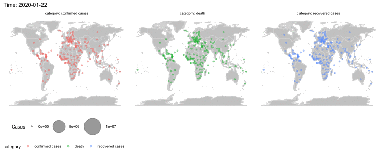

<style>                     
.navbar {
  background-color:crimson;
  border-color:white;
}
.navbar-brand {
color:white!important;
}
.chart-title {  /* chart_title  */
   font-size: 18px;

</style>   


Page 1
=====================================  

How did Covid hit different parts of the world? The visualizations below give you the story. 
The top two animated plots show the timeline of the spread of the infection and the development of the Twitter narrative. The line plots breaks down the spread by country over time, and puts the regional severity into perspective.

Row {data-height=1000}
-----------------------------------------------------------------------

```{python, eval=FALSE, echo=FALSE, warning=FALSE,message=FALSE, error=FALSE, results='hide',fig.keep='last'}
# Install Python packages
#pip install tweet-preprocessor
#pip install ekphrasis
#pip install plotly
```

```{python, eval=FALSE, echo=FALSE, warning=FALSE,message=FALSE, error=FALSE, results='hide',fig.keep='last'}
# Import Python packages
import os
import pandas as pd
import numpy as np
import pandas as pd
import regex
import string
import re
import pprint
from collections import OrderedDict
import unicodedata
import itertools
import html
from html.parser import HTMLParser
from datetime import datetime
import json
import ast
from os import listdir
from os.path import isfile, join
from collections import Counter
import preprocessor as p

import nltk
nltk.download('stopwords')
nltk.download('wordnet')
from nltk import WordNetLemmatizer
from nltk import pos_tag
from nltk.corpus import wordnet as wn
from nltk.corpus import stopwords
from nltk.sentiment.util import  mark_negation
from nltk.tokenize import TweetTokenizer
from nltk import word_tokenize, sent_tokenize, FreqDist
from nltk.stem import LancasterStemmer, WordNetLemmatizer

from sklearn.base import BaseEstimator, TransformerMixin
from sklearn.feature_extraction.text import TfidfVectorizer
from sklearn.feature_extraction.text import CountVectorizer
from sklearn.preprocessing import LabelEncoder
from sklearn.metrics import cohen_kappa_score
from sklearn.model_selection import train_test_split

import gensim
from gensim import corpora, models, similarities
from gensim.models import CoherenceModel, HdpModel

import umap
import seaborn as sns
import pyLDAvis.gensim
import plotly.graph_objects as go
import networkx as nx
import matplotlib.pyplot as plt
%matplotlib inline
```

```{r, echo=FALSE, warning=FALSE,message=FALSE,error=FALSE, results='hide',fig.keep='last'}
# Install R packages
#install.packages("ggwordcloud")
#install.packages("gifski")
```

```{r, echo=FALSE, warning=FALSE,message=FALSE,error=FALSE, results='hide',fig.keep='last'}
# Import R packages
library(flexdashboard)
library(readr)
library(dplyr)
library(reshape2)
library(lubridate)
library(ggplot2)
library(maps)
library(ggthemes)
library(gganimate)
library(scales)
library(ggwordcloud)
library(dplyr)
library(lubridate)
library(tidyverse)
```

### Map of Covid infection, death and recovery this year
```{r, eval=FALSE, echo=FALSE, warning=FALSE,message=FALSE,error=FALSE, results='hide',fig.keep='last'}
# This takes about 1 hour to render, so commenting out the eval

# confirmed cases
covid = read_csv("data/csse_covid_19_time_series/time_series_covid19_confirmed_global.csv")
covid_df = melt(covid, id.vars = c("Province/State", "Country/Region", "Lat", "Long"))
covid_df$variable <- mdy(covid_df$variable)
drops <- c("Province/State")
covid_df <- covid_df[ , !(names(covid_df) %in% drops)]
colnames(covid_df) <- c("Country", "Lat", "Long", "Date", "Cases")
covid_df <- covid_df[complete.cases(covid_df), ]
covid_df <- covid_df %>% group_by(Country, Date) %>% summarise(sum(Cases), mean(Lat), mean(Long))
colnames(covid_df) = c("Country", "Date", "Cases", "Lat", "Long")
sub_covid_df = covid_df %>%
  slice(which(row_number() %% 10 == 1))

# deaths
covid2 = read_csv("data/csse_covid_19_time_series/time_series_covid19_deaths_global.csv")
covid_df2 = melt(covid2, id.vars = c("Province/State", "Country/Region", "Lat", "Long"))
covid_df2$variable <- mdy(covid_df2$variable)
drops <- c("Province/State")
covid_df2 <- covid_df2[ , !(names(covid_df2) %in% drops)]
colnames(covid_df2) <- c("Country", "Lat", "Long", "Date", "Cases")
covid_df2 <- covid_df2[complete.cases(covid_df2), ]
covid_df2 <- covid_df2 %>% group_by(Country, Date) %>% summarise(sum(Cases), mean(Lat), mean(Long))
colnames(covid_df2) = c("Country", "Date", "Cases", "Lat", "Long")
sub_covid_df2 = covid_df2 %>%
  slice(which(row_number() %% 10 == 1))

# recovered
covid3 = read_csv("data/csse_covid_19_time_series/time_series_covid19_recovered_global.csv")
covid_df3 = melt(covid3, id.vars = c("Province/State", "Country/Region", "Lat", "Long"))
covid_df3$variable <- mdy(covid_df3$variable)
drops <- c("Province/State")
covid_df3 <- covid_df3[ , !(names(covid_df3) %in% drops)]
colnames(covid_df3) <- c("Country", "Lat", "Long", "Date", "Cases")
covid_df3 <- covid_df3[complete.cases(covid_df), ]
covid_df3 <- covid_df3 %>% group_by(Country, Date) %>% summarise(sum(Cases), mean(Lat), mean(Long))
colnames(covid_df3) = c("Country", "Date", "Cases", "Lat", "Long")
sub_covid_df3 = covid_df3 %>%
  slice(which(row_number() %% 10 == 1))

# finalize the dataframe
sub_covid_df$category = "confirmed cases"
sub_covid_df2$category = "death"
sub_covid_df3$category = "recovered cases"
sub_all = rbind(sub_covid_df, sub_covid_df2, sub_covid_df3)

# facet + animation
map_frames_year <- 
  ggplot(data = sub_all, aes(frame=Date, x = Long, y = Lat, size = Cases, color=category)) +
  borders("world", colour = "gray85", fill = "gray80") +
  theme_map() +
  geom_point(alpha = .4) +
  scale_size_continuous(range = c(1, 18)) +
  facet_wrap(vars(category), labeller = "label_both") +
  theme(legend.position="bottom", 
        legend.direction="horizontal", 
        legend.box="vertical", 
        legend.margin=margin(),
        strip.background = element_rect(fill="white", color="white"),
        strip.text.x = element_text(color = "black")) + 
  scale_y_continuous(labels=comma) + 
  labs(title = 'Time: {frame_time}') +
  transition_time(Date) +
  shadow_mark()

animate(map_frames_year, height = 300, width = 750)
anim_save("outputs/combined_anim_time_wide_new.gif")
```




### Twitter wordcloud this year. China placed in the front and center.

```{python, eval=FALSE, echo=FALSE, warning=FALSE,message=FALSE,error=FALSE, results='hide',fig.keep='last'}
### PREPROCESS THE TWEETS IN PYTHON
# Deal with different languages
a = ['hungarian','swedish','kazakh','norwegian','finnish','arabic','indonesian','portuguese','turkish',
     'azerbaijani','slovene','spanish','danish','nepali','romanian','greek','dutch','tajik','german','english','russian','french','italian']

b = pd.DataFrame([['english','en',67.75],
['spanish','es',11.79],
['portuguese','pt',3.32],
['undefined','und',2.79],
['french','fr',2.7],
['indonesian','in',2.6],
['german','de',1.26],
['japanese','ja',1.15],
['italian','it',1.08],
['turkish','tr',1.05]], columns=['lang','abr','perc'])
bb = b['lang'].apply(lambda x: x.lower()).tolist()
common = [e for e in a if e in bb]
b[b['lang'].isin(common)]['abr'].tolist()

# Define the function to clean tweets
def clean_tweets(file_path):
    tw = pd.read_csv(file_path)

    cleaned = []
    for i in range(tw.shape[0]):
        cleaned.append(p.clean(tw['text'][i]))
    tw['clean_text'] = cleaned

    def preprocess_data(data):
        #Removes Numbers
        data = data.astype(str).str.replace('\d+', '')
        lower_text = data.str.lower()
        lemmatizer = nltk.stem.WordNetLemmatizer()
        w_tokenizer =  TweetTokenizer()

        def lemmatize_text(text):
            return [(lemmatizer.lemmatize(w)) for w \
                           in w_tokenizer.tokenize((text))]

        def remove_punctuation(words):
            new_words = []
            for word in words:
                new_word = re.sub(r'[^\w\s]', '', (word))
                if new_word != '':
                    new_words.append(new_word)
            return new_words

        words = lower_text.apply(lemmatize_text)
        words = words.apply(remove_punctuation)
        return pd.DataFrame(words)
    
    tw['clean_text'] = preprocess_data(tw['clean_text'])
    
    # divert traffic for different languages
    en_stop_words = set(stopwords.words('english'))
    in_stop_words = set(stopwords.words('indonesian'))
    pt_stop_words = set(stopwords.words('portuguese'))
    tr_stop_words = set(stopwords.words('turkish'))
    es_stop_words = set(stopwords.words('spanish'))
    de_stop_words = set(stopwords.words('german'))
    fr_stop_words = set(stopwords.words('french'))
    it_stop_words = set(stopwords.words('italian'))
    mp = {'en': en_stop_words,
          'in': in_stop_words,
          'pt': pt_stop_words,
          'tr': tr_stop_words,
          'es': es_stop_words,
          'de': de_stop_words,
          'fr': fr_stop_words,
          'it': it_stop_words}
    tw = tw[tw['lang'].isin(list(mp.keys()))]
    for i, lan in enumerate(tw['lang'].unique()):
        tw_sub = tw[tw['lang'] == lan]
        tw_sub['clean_text'] = tw_sub['clean_text'].apply(lambda x: [item for item in x \
                                                                    if item not in mp[lan]])
        if i == 0:
            out = tw_sub
        else:
            out = pd.concat([out, tw_sub], axis=0)
    return out[out['user_location'].notna()][['coordinates', 'created_at', 'retweet_count', 'user_location', 'clean_text', 'lang']]
    
# Process the data (first half of the year)
mypath = 'data/tweets_data/20th/'
onlyfiles = [f for f in listdir(mypath) if isfile(join(mypath, f))]
for i, f in enumerate(onlyfiles):
    tww = clean_tweets(mypath + f)
    if i == 0:
        out = tww
    else:
        out = pd.concat([out, tww], axis=0)
out.to_csv("outputs/cleaned_tweets_20th_Jan_to_June.csv")

# Process the data (second half of the year)
mypath = 'data/tweets_data/20th/rest_of_the_year'
onlyfiles = [f for f in listdir(mypath) if isfile(join(mypath, f))]
for i, f in enumerate(onlyfiles):
    tww = clean_tweets(mypath + f)
    if i == 0:
        out = tww
    else:
        out = pd.concat([out, tww], axis=0)
out.to_csv("outputs/cleaned_tweets_20th_July_to_Nov.csv")
out1 = pd.read_csv("outputs/cleaned_tweets_20th_Jan_to_June.csv", index_col=0).reset_index(drop=True)
out1['clean_text'] = out1['clean_text'].apply(lambda x: ast.literal_eval(x)).tolist()
out = out.reset_index(drop=True)
OUT = pd.concat([out1, out], axis=0)
OUT['date'] = OUT['created_at'].apply(lambda x: x[4:10])
OUT2 = OUT[~OUT['date'].isin(['Jun 19','Nov 19','Aug 19','Oct 19','Sep 19','Jul 19'])]

# Get word count per day per language (for the word clouds)
for i, day in enumerate(list(OUT2['date'].unique())):
    out_sub = OUT2[OUT2['date'] == day]
    print(day, out_sub.shape)
    for j, lan in enumerate(list(out_sub['lang'].unique())):
        out_sub_lan = out_sub[out_sub['lang'] == lan]
        t = out_sub_lan['clean_text'].tolist()
        flat_list = [item for sublist in t for item in sublist]
        words = pd.Series(flat_list).value_counts().to_frame().reset_index()
        words.columns = ['word', 'count']
        words['date'] = [day] * words.shape[0]
        words['lang'] = [lan] * words.shape[0]  
        if (i == 0) & (j == 0):
            df = words
        else:
            df = pd.concat([df, words], axis=0)
df['date'] = df['date'].apply(lambda x: '2020 ' + x).apply(lambda x: datetime.strptime(x, '%Y %b %d'))
df['word_length'] = df['word'].apply(lambda x: len(x))
df2 = df[df['word_length'] > 2].reset_index(drop=True)
df2.to_csv("outputs/word_count_date_lang_all.csv")
```

```{r, eval=FALSE, echo=FALSE, warning=FALSE,message=FALSE, error=FALSE, results='hide',fig.keep='last'}
# This takes 1~4 hours to render so commenting the eval out.
wc1 = read.csv("outputs/word_count_date_lang_all.csv")
wc1$date <- ymd(wc1$date)
wc2 <- wc1 %>%
  arrange(desc(count)) %>%
  group_by(date, lang) %>%
  slice(1:50) 
wc2
normalize <- function(x){
  return((x-min(x)) / (max(x)-min(x)))}

wc3 <- wc2 %>%
  group_by(lang, date) %>%
  mutate(count = normalize(count))


levels(wc3$lang) <- c(levels(wc3$lang), "English", "Spanish", "German", "Italian", "Portuguese", "Indonesian", "Turkish", "French")
wc3$lang[wc3$lang == 'en'] <- 'English'
wc3$lang[wc3$lang == 'es'] <- 'Spanish'
wc3$lang[wc3$lang == 'de'] <- 'German'
wc3$lang[wc3$lang == 'it'] <- 'Italian'
wc3$lang[wc3$lang == 'pt'] <- 'Portuguese'
wc3$lang[wc3$lang == 'in'] <- 'Indonesian'
wc3$lang[wc3$lang == 'tr'] <- 'Turkish'
wc3$lang[wc3$lang == 'fr'] <- 'French'
colnames(wc3) = c("X", "word", "count", "date", "Language")
wc3 = wc3[1:5]

word_cloud_anim <- 
  ggplot(data=wc3, aes(frame=date, label = word, size = count, color = Language)) +
  geom_text_wordcloud_area(rm_outside=TRUE) +
  scale_size_area(max_size = 12) +
  scale_x_discrete(breaks = NULL) +
  facet_wrap(vars(Language),  ncol = 4, labeller = "label_both") +
  theme_minimal() + 
  theme(strip.background = element_rect(fill="white", color="white"),
        strip.text.x = element_text(color = "black")) +
  labs(title = 'Time: {frame_time}') +
  transition_time(date) +
  shadow_mark()

animate(word_cloud_anim, renderer=gifski_renderer("outputs/word_cloud_anim2.gif"))
```


Row {data-height=600}
-----------------------------------------------------------------------

### Covid is growing exponentially in the US, India and Brazil

```{r, echo=FALSE, warning=FALSE,message=FALSE,error=FALSE, results='hide',fig.keep='last'}
covid = read_csv("data/csse_covid_19_time_series/time_series_covid19_confirmed_global.csv")
covid_df = melt(covid, id.vars = c("Province/State", "Country/Region", "Lat", "Long"))
covid_df$variable <- mdy(covid_df$variable)
drops <- c("Province/State")
covid_df <- covid_df[ , !(names(covid_df) %in% drops)]
colnames(covid_df) <- c("Country", "Lat", "Long", "Date", "Cases")
covid_df <- covid_df[complete.cases(covid_df), ]
covid_df$cases10k <- covid_df$Cases / 10000
covid_df <- covid_df %>% group_by(Country, Date) %>% summarise(sum(Cases))
colnames(covid_df) = c("Country", "Date", "Cases")
exp <- covid_df %>%
  filter(Country %in% c("China", "US", "Argentina","Japan", "Brazil", "Italy", "France", "India", "Russia"))

fancy_scientific <- function(l) {
     l <- format(l, scientific = TRUE)
     l <- gsub("^(.*)e", "'\\1'e", l)
     l <- gsub("e", "%*%10^", l)
     parse(text=l)
}

ggplot() +
    geom_line(data=covid_df, aes(x=Date, y=Cases, group = Country), colour = "gray78", show.legend = F) +
    geom_line(data=exp, aes(x=Date, y=Cases, group = Country, colour = Country)) + theme_minimal() +
   scale_y_continuous(labels=fancy_scientific)
```

### China has flattened the curve. France and the US are getting sick faster than recovering

```{r, echo=FALSE, warning=FALSE,message=FALSE,error=FALSE, results='hide',fig.keep='last'}
covid2 = read_csv("data/csse_covid_19_time_series/time_series_covid19_deaths_global.csv")
covid_death = melt(covid2, id.vars = c("Province/State", "Country/Region", "Lat", "Long"))
covid_death$variable <- mdy(covid_death$variable)
drops <- c("Province/State")
covid_death <- covid_death[ , !(names(covid_death) %in% drops)]
colnames(covid_death) <- c("Country", "Lat", "Long", "Date", "Cases")
covid_death <- covid_death[complete.cases(covid_death), ]
covid_death$cases10k <- covid_death$Cases / 10000
covid_death <- covid_death %>% group_by(Country, Date) %>% summarise(sum(Cases))
colnames(covid_death) = c("Country", "Date", "Cases")
exp_death <- covid_death %>%
  filter(Country %in% c("China", "US", "Argentina","Japan", "Brazil", "Italy", "France", "India", "Russia"))

covid3 = read_csv("data/csse_covid_19_time_series/time_series_covid19_recovered_global.csv")
covid_rec = melt(covid3, id.vars = c("Province/State", "Country/Region", "Lat", "Long"))
covid_rec$variable <- mdy(covid_rec$variable)
drops <- c("Province/State")
covid_rec <- covid_rec[ , !(names(covid_rec) %in% drops)]
colnames(covid_rec) <- c("Country", "Lat", "Long", "Date", "Cases")
covid_rec <- covid_rec[complete.cases(covid_rec), ]
covid_rec$cases10k <- covid_rec$Cases / 10000
covid_rec <- covid_rec %>% group_by(Country, Date) %>% summarise(sum(Cases))
colnames(covid_rec) = c("Country", "Date", "Cases")
exp_rec <- covid_rec %>%
  filter(Country %in% c("China", "US", "Argentina","Japan", "Brazil", "Italy", "France", "India", "Russia"))

exp$category = "confirmed cases"
exp_death$category = "death"
exp_rec$category = "recovered cases"
exp_all = rbind(exp, exp_death, exp_rec)
exp_all_2 <- exp_all %>%
  group_by(Country, category, Date) %>%
  summarise(sum(Cases))
colnames(exp_all_2) = c("Country", "category", "Date", "Cases")

ggplot(exp_all_2, aes(Date, Cases)) +
  geom_line(size=1, aes(color=category)) +
  facet_wrap(vars(Country), labeller = "label_both", scales = "free") +
  scale_y_continuous(labels=fancy_scientific) + 
  theme_minimal()
```

### Think Covid situations in these countries are similar? Let's unify the scales

```{r, echo=FALSE, warning=FALSE,message=FALSE,error=FALSE, results='hide',fig.keep='last'}
ggplot(exp_all_2, aes(Date, Cases)) +
  geom_line(size=1, aes(color=category)) +
  facet_wrap(vars(Country), labeller = "label_both") +
  scale_y_continuous(labels=fancy_scientific) + 
  theme_minimal()
```


Page 2 {data-orientation=columns}
=====================================  

These weighted networks are made by taking the top 100 words in the English tweets during the first half of the pandemic (left) and the pandemic as a whole (right). If two words show up in the same tweet, then an edge is made to connect them. We see how the network communities changed between June and now. 

Before this fall, "trump" is further away from the center of "covid", connecting to another community of keywords like "tulsa rally", "mask", "social distancing", and "hospital", but later on shifted to the front and center. This might be because early on in the pandemic, people were generally okay with the president's handling of it. However as time went on, more people began to think that he is directly related to or responsible for the current covid situation. 

Column {data-width=650}
-----------------------------------------------------------------------

### Network on Twitter keywords in Spring and Summer

```{python, eval=FALSE, echo=FALSE, warning=FALSE,message=FALSE,error=FALSE, results='hide',fig.keep='last'}
# Taking top 100 keywords from the first six months of the pandemic
t = out1[out1['lang'] == 'en']['clean_text']
flat_list = [item for sublist in t for item in sublist]
words_all = pd.Series(flat_list).value_counts().to_frame().reset_index()
words_all.columns = ['word', 'count']
top100 = words_all[:100]
pairs = list(itertools.combinations(top100['word'].tolist(), 2))
tocheck = out['clean_text']

weight = []
for p in pairs:
    w = out[(out['clean_text'].apply(lambda x: p[0] in x)) & (out['clean_text'].apply(lambda x: p[1] in x))].shape[0]
    weight.append(w)
with open('outputs/network_weights.txt', 'w') as f:
    for w in weight:
        f.write("%s\n" % w)
net = pd.concat([pd.DataFrame(pairs), pd.Series(weight)], axis=1)
net.columns = ['edgeA', 'edgeB', 'weight']
net['weight'] = net['weight'].astype(int)
tuples = [tuple(x) for x in net.to_numpy()]
G = nx.Graph()   
G.add_weighted_edges_from(tuples)
pos_spaced = nx.fruchterman_reingold_layout(G, k=0.54, iterations=100)

# static plot with networkx
plt.figure(figsize=(16,10))
d = dict(G.degree)
nx.draw(g,
        pos=pos_spaced,
        with_labels=True, 
        edge_color='lightblue',
        node_color='crimson',
        font_color='white',
        node_size=top100['count'].tolist(),
        alpha=0.7)
plt.tight_layout()
plt.savefig('outputs/static_network.png')

# with plotly
top100['anot'] = top100['word'] + [': '] * 100 + top100['count'].astype(str)
edge_x = []
edge_y = []
for edge in G.edges():
    x0, y0 = pos_spaced[edge[0]]
    x1, y1 = pos_spaced[edge[1]]
    edge_x.append(x0)
    edge_x.append(x1)
    edge_x.append(None)
    edge_y.append(y0)
    edge_y.append(y1)
    edge_y.append(None)

edge_trace = go.Scatter(
    x=edge_x, y=edge_y,
    line=dict(width=0.5, color='#888'),
    hoverinfo='none',
    mode='lines')

node_x = []
node_y = []
for node in G.nodes():
    x, y = pos_spaced[node]
    node_x.append(x)
    node_y.append(y)

node_trace = go.Scatter(
    x=node_x, y=node_y,
    mode='markers+text',
    hoverinfo='text',
    hovertext=top100['anot'].tolist(),
    text=top100['word'].tolist(),
    marker=dict(
        showscale=True,
        color=[],
        size=10),
        line_width=2)
node_text = top100['word'].values
node_trace.marker.color = 'crimson'
node_trace.text = node_text
node_trace.marker.size=[v/400 for v in top100['count'].tolist()]
edge_trace.line.color='lightblue'
fig = go.Figure(data=[edge_trace, node_trace],
             layout=go.Layout(
                title='<br>The Covid 19 Tweet Word Cloud (Jan to June 2020)',
                titlefont_size=16,
                showlegend=False,
                hovermode='closest',
                margin=dict(b=20,l=5,r=5,t=40),
                annotations=[ dict(
                    showarrow=False,
                    xref="paper", yref="paper",
                    x=0.005, y=-0.002 ) ],
                xaxis=dict(showgrid=False, zeroline=False, showticklabels=False),
                yaxis=dict(showgrid=False, zeroline=False, showticklabels=False),
                paper_bgcolor='rgba(0,0,0,0)',
                plot_bgcolor='rgba(0,0,0,0)')
                )
fig.show()
fig.write_html("outputs/word_cloud_plotly.html")
```

```{r, echo=FALSE}
htmltools::includeHTML("outputs/word_cloud_plotly.html")
```

Column {data-width=650}
-----------------------------------------------------------------------

### Network on Twitter keywords the whole year
```{python, eval=FALSE, echo=FALSE, warning=FALSE,message=FALSE,error=FALSE, results='hide',fig.keep='last'}
# Taking top 100 keywords from all year's tweets
t = OUT2[OUT2['lang'] == 'en']['clean_text']
flat_list = [item for sublist in t for item in sublist]
words_all = pd.Series(flat_list).value_counts().to_frame().reset_index()
words_all.columns = ['word', 'count']
top100 = words_all[:100]
pairs = list(itertools.combinations(top100['word'].tolist(), 2))
tocheck = out['clean_text']

weight = []
for p in pairs:
    w = out[(out['clean_text'].apply(lambda x: p[0] in x)) & (out['clean_text'].apply(lambda x: p[1] in x))].shape[0]
    weight.append(w)
with open('outputs/network_weights_all.txt', 'w') as f:
    for w in weight:
        f.write("%s\n" % w)
net = pd.concat([pd.DataFrame(pairs), pd.Series(weight)], axis=1)
net.columns = ['edgeA', 'edgeB', 'weight']
net['weight'] = net['weight'].astype(int)
tuples = [tuple(x) for x in net.to_numpy()]
G = nx.Graph()   
G.add_weighted_edges_from(tuples)

# static network with networkx
pos_spaced = nx.fruchterman_reingold_layout(G, k=0.54, iterations=100)
plt.figure(figsize=(16,10))
d = dict(G.degree)
nx.draw(G,
        pos=pos_spaced,
        with_labels=True, 
        edge_color='lightblue',
        node_color='crimson',
        font_color='white',
        node_size=[v * 0.3 for v in top100['count'].tolist()],
        alpha=0.7)
plt.tight_layout()
plt.savefig('static_network/_all_year.png')

# with plotly
top100['anot'] = top100['word'] + [': '] * 100 + top100['count'].astype(str)
edge_x = []
edge_y = []
for edge in G.edges():
    x0, y0 = pos_spaced[edge[0]]
    x1, y1 = pos_spaced[edge[1]]
    edge_x.append(x0)
    edge_x.append(x1)
    edge_x.append(None)
    edge_y.append(y0)
    edge_y.append(y1)
    edge_y.append(None)

edge_trace = go.Scatter(
    x=edge_x, y=edge_y,
    line=dict(width=0.5, color='#888'),
    hoverinfo='none',
    mode='lines')

node_x = []
node_y = []
for node in G.nodes():
    x, y = pos_spaced[node]
    node_x.append(x)
    node_y.append(y)

node_trace = go.Scatter(
    x=node_x, y=node_y,
    mode='markers+text',
    hoverinfo='text',
    hovertext=top100['anot'].tolist(),
    text=top100['word'].tolist(),
    marker=dict(
        showscale=True,
        color=[],
        size=10),
        line_width=2)
node_text = top100['word'].values
node_trace.marker.color = 'crimson'
node_trace.text = node_text
node_trace.marker.size=[v/400 for v in top100['count'].tolist()]
edge_trace.line.color='lightblue'
fig = go.Figure(data=[edge_trace, node_trace],
             layout=go.Layout(
                title='<br>The Covid 19 Tweet Word Cloud (Jan to Nov 2020)',
                titlefont_size=16,
                showlegend=False,
                hovermode='closest',
                margin=dict(b=20,l=5,r=5,t=40),
                annotations=[ dict(
                    showarrow=False,
                    xref="paper", yref="paper",
                    x=0.005, y=-0.002 ) ],
                xaxis=dict(showgrid=False, zeroline=False, showticklabels=False),
                yaxis=dict(showgrid=False, zeroline=False, showticklabels=False),
                paper_bgcolor='rgba(0,0,0,0)',
                plot_bgcolor='rgba(0,0,0,0)')
                )
fig.show()
fig.write_html("outputs/word_cloud_plotly_all_year.html")
```

```{r,  echo=FALSE}
options(width = 200)
htmltools::includeHTML("outputs/word_cloud_plotly_all_year.html")
```

Page 3
=====================================  

This visualization shows the topics discovered by an LDA model. Interact with the bubbles and words to see which cluster represent what topics. 

Comparing cluster 3, 4 with cluster 1, we see that cluster 4 is made of key words such as "fauci", "science" and "vaccine", whereas cluster 1 is made of "covid", "death" and "new cases". This probably means that PC1 represents two sides of people's attitudes towards covid. Interestingly, three people are ranked high among the keywords: "donald trump", "ryanafournier", "joebiden" and "nicolasmaduro". Joe Biden shows up in cluster 4 whereas Donald Trump shows up in cluster 1.

Row {data-height=850}
-----------------------------------------------------------------------

```{python, eval=FALSE, echo=FALSE, warning=FALSE,message=FALSE,error=FALSE, results='hide',fig.keep='last'}
mypath1 = 'data/tweets_data/20th/'
onlyfiles1 = [f for f in listdir(mypath1) if isfile(join(mypath1, f))]
onlyfiles1.remove('.DS_Store')
mypath2 = 'data/tweets_data/20th/rest_of_the_year/'
onlyfiles2 = [f for f in listdir(mypath2) if isfile(join(mypath2, f))]

for i, f in enumerate(onlyfiles1):
    d = pd.read_csv(mypath1 + f)
    if i == 0:
        train = d
    else:
        train = pd.concat([train, d], axis=0)
for i, f in enumerate(onlyfiles2):
    d = pd.read_csv(mypath2 + f)
    if i == 0:
        train2 = d
    else:
        train2 = pd.concat([train2, d], axis=0)
TRAIN = pd.concat([train, train2], axis=0).reset_index(drop=True)

# Prepare the corpus for analysis and checking first 10 entries
corpus = []
for i in range(len(TRAIN['text'])):
    tweet = TRAIN['text'][i]
    # Remove the urls
    tweet = re.sub(r'http\S+', '', tweet)
    # Remove the character tags for mentions and hashtags
    tweet = tweet.replace("@", "").replace("#", "")
    # Remove other characters
    tweet = tweet.replace("&amp;", " ").replace("&gt;", "").replace("&lt;", "")
    tweet = tweet.replace("(", "").replace(")", "").replace(".", "").replace("?", "").replace("!", "").replace(",", "")
    tweet = tweet.replace("/", " ").replace("=", "").replace('\"', "").replace('*', '').replace(';', "")
    tweet = tweet.replace(':', '').replace('"', '')
    tweet = re.sub(r'\$[0-9]+', '', tweet)
    tweet = re.sub(r'[0-9]+GB', '', tweet)
    tweet = re.sub(r'[0-9]+', '', tweet)
    tweet = re.sub(r'--+', ' ', tweet)
    # replace weird characters
    tweet = re.sub(r'[^0-9a-zA-Z:,]+', ' ', tweet)
    corpus.append(tweet)

# Remove stopwords
list1 = ['RT','rt', '&amp;', 'im', 'b4', 'yr', 'nd', 'rd', 'oh', "can't", "he's", "i'll",
         "i'm", 'ta', "'s", "c'mon", 'th', 'st', "that's", "they're", "i've", 'am', 'pm']
stoplist = stopwords.words('english') +stopwords.words('indonesian')+stopwords.words('portuguese')+stopwords.words('turkish')\
+stopwords.words('spanish')+stopwords.words('german')+stopwords.words('french')+stopwords.words('italian')\
+ list(string.punctuation) + list1 + ['semst']

# Remove tokens in the text that match the stoplist
texts = [[word for word in str(document).lower().split() if word not in stoplist] for document in corpus]

# Create and save the dictionary
dictionary = corpora.Dictionary(texts)
doc_lengths = [len(text) for text in texts]

# prepare corpus
corpus = [dictionary.doc2bow(text) for text in texts]
tfidf = models.TfidfModel(corpus) 
corpus_tfidf = tfidf[corpus]  

# Set LDA parameters
N_TOPICS = 5
AVG_DOC_LENGTH = np.mean(doc_lengths)
nih_alpha = np.full(N_TOPICS, (0.05 * AVG_DOC_LENGTH) / N_TOPICS)  
lda_alpha = ['auto', 'symmetric', 'asymmetric', nih_alpha]

# Try four different LDA models
corpi = []
lda_models = []
for i in range(len(lda_alpha)):
    alpha = lda_alpha[i]
    lda = models.LdaModel(corpus, 
                          id2word = dictionary, 
                          num_topics = N_TOPICS, 
                          iterations = 1000, 
                          alpha=alpha)
    corpus_lda = lda[corpus] 
    lda_models.append(lda)
    t = lda.show_topics(N_TOPICS, 10)
    if i != 3:
        print("LDA alpha:", alpha, "\n", t)
    else:
        print("LDA alpha: NIH paper", "\n", t)
    # Load the topic - term data into an python dictionary
    data_lda = {i: OrderedDict(lda.show_topic(i,20)) for i in range(N_TOPICS)}
    df_lda = pd.DataFrame(data_lda)
    df_lda = df_lda.fillna(0).T
    print("LDA df shape:", df_lda.shape, "\n")
    
# Display the vis
pyLDAvis.enable_notebook()
panel = pyLDAvis.gensim.prepare(lda_models[0], corpus, dictionary, mds='tsne')
pyLDAvis.save_html(panel, 'outputs/lda_all.html')
```

### LDA Topic Model
```{r, echo=FALSE}
options(width = 200)
htmltools::includeHTML("outputs/lda_all.html")
```


