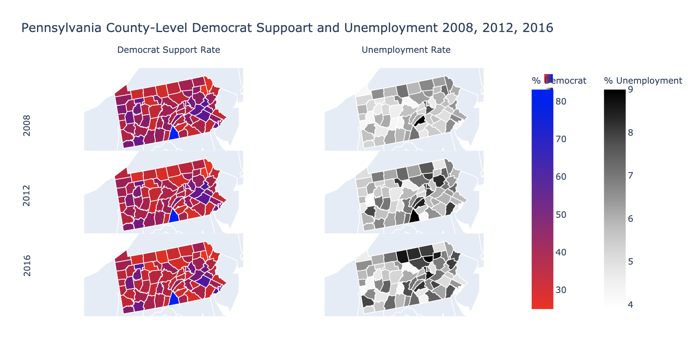

```{r setup, include=FALSE, eval=FALSE, echo=FALSE, warning=FALSE,message=FALSE, error=FALSE, results='hide',fig.keep='last'}
#Sys.setenv(RETICULATE_PYTHON = "C:\\Users\\Perry\\Anaconda3\\envs\\r-reticulate")
library(reticulate)
#use_condaenv("r-reticulate")
use_python("C:\\Users\\Perry\\Anaconda3\\envs\\reticulate\\python.exe", required=TRUE)

# install packages
conda_create("reticulate")
conda_install("reticulate", packages = "pip")
conda_install("reticulate", packages = "python=3.7")
#conda_install("reticulate", packages = "nomkl")
conda_install("reticulate", packages = "pandas")
conda_install("reticulate", packages = "xlrd")
conda_install("reticulate", packages = "numpy")
conda_install("reticulate", packages = "tabulate", pip = TRUE)
conda_install("reticulate", packages = "C:/Users/Perry/Downloads/GDAL‑3.1.4‑cp37‑cp37m‑win_amd64.whl", pip = TRUE)
conda_install("reticulate", packages = "C:/Users/Perry/Downloads/Fiona‑1.8.17‑cp37‑cp37m‑win_amd64.whl", pip = TRUE)
conda_install("reticulate", packages = "plotly", pip = TRUE)
#conda_install("reticulate", packages = "ipython", pip = TRUE)
#conda_install("reticulate", packages = "psutil", pip = TRUE)
#conda_install("reticulate", packages = "requests", pip = TRUE)

# print out system path
old_path = Sys.getenv("PATH")
print(old_path)
Sys.setenv(PATH = paste("C:\\Users\\Perry\\anaconda3\\envs\\reticulate\\Scripts", sep = ";",old_path))
print(Sys.getenv("PATH"))

py_module_available('pandas')
py_module_available('fiona')
py_module_available('tabulate')
py_module_available('plotly')
```


```{python, eval=FALSE, echo=FALSE, warning=FALSE,message=FALSE, error=FALSE, results='hide',fig.keep='last'}
import os
sys.path.insert(1, "C:\\Users\\Perry\\anaconda3\\envs\\r-reticulate\\Lib\\site-packages")
os.environ['KMP_DUPLICATE_LIB_OK']='True'
```


```{r, echo=FALSE, warning=FALSE,message=FALSE, error=FALSE, results='hide',fig.keep='last'}
library(reshape2)
library(tidyverse)
library(readxl)
library(sf)
library(gridExtra)
library(grid)
```


```{r, echo=FALSE, warning=FALSE,message=FALSE, error=FALSE, results='hide',fig.keep='last'}
# Ingest data
election <- read.csv("data/countypres_2000-2016.csv")
unemployment <- read_excel("data/Unemployment.xls", skip=7)
counties <- st_read("/Users/zhiyulin/anly503/fall2020/anly503-fall2020-a6-zlds123/data/tl_2019_us_county-1/tl_2019_us_county.shp")
```

## Texas

```{r, echo=FALSE, warning=FALSE,message=FALSE, error=FALSE, results='hide',fig.keep='last'}
# Get the fips and geometry for Texas
tx_shape <- counties %>%
  filter(STATEFP==48) %>% # texas
  mutate(fips = as.numeric(paste0(STATEFP, COUNTYFP))) %>%
  select(c(fips, geometry))

# Get the county~fips conversion for Texas
tx_county_fips <- election %>%
  select(c(year, state_po, county, FIPS)) %>%
  filter(year == 2008) %>%
  filter(state_po == 'TX') %>%
  group_by(county) %>%
  summarize(fips = FIPS[1])

# Get the employment rate for Texas
tx_unemployment_wide <- unemployment %>%
  filter(Stabr == "TX") %>%
  select(c(FIPStxt, Unemployment_rate_2008, Unemployment_rate_2012, Unemployment_rate_2016))
colnames(tx_unemployment_wide) <- c("fips", 2008, 2012, 2016)
tx_unemployment <- melt(tx_unemployment_wide, id.vars = "fips", variable.name = "year", value.name = "Unemployment Rate")

head(tx_shape)
head(tx_county_fips)
head(tx_unemployment)
```

```{r, echo=FALSE, warning=FALSE,message=FALSE, error=FALSE, results='hide',fig.keep='last'}
# Tidy the data and get it into the format ready for plotting
tidy_tx <- election %>% 
  filter(year %in% c(2008, 2012, 2016)) %>%
  filter(state_po == 'TX') %>% 
  group_by(year, county) %>%
  arrange(party, .by_group = TRUE)  %>%
  summarize("Democrat Support Rate" = candidatevotes[1]/sum(candidatevotes) * 100) %>%
  left_join(tx_county_fips, by = "county") %>%
  left_join(tx_shape, by = "fips") %>%
  mutate(temp = paste0(fips, "_", year))  %>%
  left_join(tx_unemployment %>% mutate(temp = paste0(fips, "_", year)), by = "temp") %>%
  select(c(year.x, county, fips.x, geometry, "Democrat Support Rate", "Unemployment Rate")) %>%
  rename(year = year.x, fips = fips.x)

tidy_tx <- melt(tidy_tx, id.vars = c("year", "county", "fips", "geometry"), variable.name = "type", value.name = "value")
head(tidy_tx)
```

```{r, echo=FALSE, warning=FALSE,message=FALSE, error=FALSE, results='hide',fig.keep='last'}
tx_facet_plot_1 <- 
  tidy_tx %>% 
  filter(type == "Democrat Support Rate") %>%
  ggplot() + 
  geom_sf(aes(geometry = geometry,
              fill= value), 
          color = "white",
          size = 0.2) + 
  facet_wrap(~year, ncol=1) + 
  guides(fill = guide_colourbar(barwidth = 0.5, barheight = 10, title.position = "bottom",  title.theme = element_text(angle = 90))) + 
  scale_fill_gradient(name='% Democrat Support', low='red', high='navyblue', limits=c(0, 100)) +
  theme_bw() + 
  theme(plot.margin=unit(x=c(0,0,0,0),units="mm"))
```


```{r, echo=FALSE, warning=FALSE,message=FALSE, error=FALSE, results='hide',fig.keep='last'}
tx_facet_plot_2 <- 
  tidy_tx %>% 
    filter(type == "Unemployment Rate") %>%
  ggplot() + 
  geom_sf(aes(geometry = geometry,
              fill= value), 
          color = "white",
          size = 0.2) + 
  facet_wrap(~year, ncol=1) + 
  guides(fill = guide_colourbar(barwidth = 0.5, barheight = 10, title.position = "bottom",  title.theme = element_text(angle = 90))) + 
  scale_fill_gradient(name='% Unemployment', low='grey90', high='grey16', limits=c(0, 30)) +
  theme_bw() + 
  theme(plot.margin=unit(x=c(0,0,0,0),units="mm"))
```


```{r, echo=FALSE, warning=FALSE,message=FALSE, error=FALSE, results='hide',fig.keep='last'}
grid.arrange(tx_facet_plot_1, 
             tx_facet_plot_2, 
             ncol=2,
             top = textGrob("Texas county-level democrat support and unemployment rate",
                            gp=gpar(fontsize=12,font=1)))
```

## California

```{r, echo=FALSE, warning=FALSE,message=FALSE, error=FALSE, results='hide',fig.keep='last'}
# Get the fips and geometry for Texas
ca_shape <- counties %>%
  filter(STATEFP=="06") %>% # california
  mutate(fips = as.numeric(paste0(STATEFP, COUNTYFP))) %>%
  select(c(fips, geometry))

# Get the county~fips conversion for Texas
ca_county_fips <- election %>%
  select(c(year, state_po, county, FIPS)) %>%
  filter(year == 2008) %>%
  filter(state_po == 'CA') %>%
  group_by(county) %>%
  summarize(fips = FIPS[1])

# Get the employment rate for Texas
ca_unemployment_wide <- unemployment %>%
  filter(Stabr == "CA") %>%
  select(c(FIPStxt, Unemployment_rate_2008, Unemployment_rate_2012, Unemployment_rate_2016))
colnames(ca_unemployment_wide) <- c("fips", 2008, 2012, 2016)
ca_unemployment <- melt(ca_unemployment_wide, id.vars = "fips", variable.name = "year", value.name = "Unemployment Rate")

head(ca_shape)
head(ca_county_fips)
head(ca_unemployment)
```

```{r, echo=FALSE, warning=FALSE,message=FALSE, error=FALSE, results='hide',fig.keep='last'}
# Tidy the data and get it into the format ready for plotting
tidy_ca <- election %>% 
  filter(year %in% c(2008, 2012, 2016)) %>%
  filter(state_po == 'CA') %>% 
  group_by(year, county) %>%
  arrange(party, .by_group = TRUE)  %>%
  summarize("Democrat Support Rate" = candidatevotes[1]/sum(candidatevotes) * 100) %>%
  left_join(ca_county_fips, by = "county") %>%
  left_join(ca_shape, by = "fips") %>%
  mutate(temp = paste0("0", fips, "_", year))  %>%
  left_join(ca_unemployment %>% mutate(temp = paste0(fips, "_", year)), by = "temp") %>%
  select(c(year.x, county, fips.x, geometry, "Democrat Support Rate", "Unemployment Rate")) %>%
  rename(year = year.x, fips = fips.x)

tidy_ca <- melt(tidy_ca, id.vars = c("year", "county", "fips", "geometry"), variable.name = "type", value.name = "value")
head(tidy_ca)
```

```{r, echo=FALSE, warning=FALSE,message=FALSE, error=FALSE, results='hide',fig.keep='last'}
ca_facet_plot_1 <- 
  tidy_ca %>% 
  filter(type == "Democrat Support Rate") %>%
  ggplot() + 
  geom_sf(aes(geometry = geometry,
              fill= value), 
          color = "white",
          size = 0.2) + 
  facet_wrap(~year, ncol=1) + 
  guides(fill = guide_colourbar(barwidth = 0.5, barheight = 10, title.position = "bottom",  title.theme = element_text(angle = 90))) + 
  scale_fill_gradient(name='% Democrat Support', low='red', high='navyblue', limits = c(0,100)) +
  theme_bw() + 
  theme(plot.margin=unit(x=c(0,0,0,0),units="mm"))
```


```{r, echo=FALSE, warning=FALSE,message=FALSE, error=FALSE, results='hide',fig.keep='last'}
ca_facet_plot_2 <- 
  tidy_ca %>% 
    filter(type == "Unemployment Rate") %>%
  ggplot() + 
  geom_sf(aes(geometry = geometry,
              fill= value), 
          color = "white",
          size = 0.2) + 
  facet_wrap(~year, ncol=1) + 
  guides(fill = guide_colourbar(barwidth = 0.5, barheight = 10, title.position = "bottom",  title.theme = element_text(angle = 90))) + 
  scale_fill_gradient(name='% Unemployment', low='grey90', high='grey16', limits = c(0, 30)) +
  theme_bw() + 
  theme(plot.margin=unit(x=c(0,0,0,0),units="mm"))
```


```{r, echo=FALSE, warning=FALSE,message=FALSE, error=FALSE, results='hide',fig.keep='last'}
grid.arrange(ca_facet_plot_1, 
             ca_facet_plot_2, 
             ncol=2,
             top = textGrob("California county-level democrat support and unemployment rate",
                            gp=gpar(fontsize=12,font=1)))
```

## Pennsylvania

```{python, echo=F, eval=F, mappImage, screenshot.force = TRUE, warning=FALSE,message=FALSE, error=FALSE, results='hide',fig.keep='last'}
import pandas as pd
import fiona
from tabulate import tabulate
import plotly.graph_objects as go
pd.options.display.max_columns = None

election = pd.read_csv("data/countypres_2000-2016.csv")
unemployment = pd.read_excel("data/Unemployment.xls",skiprows = range(7))
counties = fiona.open("/Users/zhiyulin/anly503/fall2020/anly503-fall2020-a6-zlds123/data/tl_2019_us_county-1/tl_2019_us_county.shp")

# Basic preparation
pa_prop = []
pa_geom = []
out = {'type': 'FeatureCollection'}
out['features'] = []
for i in range(len(counties)):
    if counties[i]['properties']['STATEFP'] == '42':
        pa_prop.append(counties[i]['properties'])
        pa_geom.append(counties[i]['geometry'])
        out['features'].append(counties[i])
        
PA = pd.concat([pd.DataFrame(pa_prop), pd.DataFrame(pa_geom)], axis=1)
PA['fips'] = PA['STATEFP'].astype(str) + PA['COUNTYFP'].astype(str)

# Get geometry
pa_shape = PA[['fips', 'coordinates']]

# Get fips county name conversion
pa_county_fips = election[election['state_po'] == 'PA'][['county', 'FIPS']].drop_duplicates().reset_index(drop=True)
pa_county_fips.rename(columns = {'FIPS':'fips'}, inplace=True)
pa_county_fips['fips'] = pa_county_fips['fips'].astype(int).astype(str)

# Get unemployment
temp = unemployment[unemployment['Stabr'] == 'PA'][['FIPStxt', 'Unemployment_rate_2008', 'Unemployment_rate_2012', 'Unemployment_rate_2016']]
temp.columns = ['fips', 2008, 2012, 2016]
pa_unemployment = pd.melt(temp, id_vars = ['fips'], var_name='year', value_name='Unemployment Rate')

print("FIPS df:\n", tabulate(pa_county_fips.head(), headers='keys'), "\n")
print("Unemployment df: \n", tabulate(pa_unemployment.head(), headers='keys'), "\n")
pa_shape['display'] = pa_shape['coordinates'].apply(lambda x: str(x)[:20] + '...')
print("Shape df: \n", tabulate(pa_shape[['fips', 'display']].head(), headers='keys'))

# Join with fips and geometry
temp2 = election[(election['year'].isin([2008, 2012, 2016])) & (election['state_po'] == 'PA')]\
.groupby(['year', 'county'])\
.apply(lambda x: x.sort_values(['party']).reset_index(drop=True)['candidatevotes'][0]/sum(x.candidatevotes) * 100)\
.reset_index()\
.merge(pa_county_fips, on='county')\
.merge(pa_shape, on='fips')

# Join with unemployment data and melt
temp2['joinby'] = temp2['fips'] + ["_"] * temp2.shape[0] + temp2['year'].astype(str)
pa_unemployment['joinby'] = pa_unemployment['fips'].astype(str) + ["_"] * pa_unemployment.shape[0] + pa_unemployment['year'].astype(str)
tidy_pa = temp2.merge(pa_unemployment, on="joinby")[['year_x', 'county', 0, 'fips_x', 'coordinates', 'Unemployment Rate']]\
.rename(columns = {'year_x': 'year', 0: 'Democrat Support Rate', 'fips_x': 'fips', 'coordinates': 'geometry'})
tidy_pa = pd.melt(tidy_pa, id_vars = ['year', 'county', 'fips', 'geometry'], var_name = 'type', value_name = 'value')\
.sort_values(['year', 'county'])\
.reset_index(drop=True)
tidy_pa.head()

fig = go.Figure()
layout = dict(
    title_text = "Pennsylvania County-Level Democrat Suppoart and Unemployment 2008, 2012, 2016",
    geo_scope='usa',
    annotations=[
            go.layout.Annotation(
                text='2016',
                align='center',
                showarrow=False,
                xref='paper',
                yref='paper',
                x=-0.05,
                y=0.152,
                textangle=-90
            ),
            go.layout.Annotation(
                text='2012',
                align='center',
                showarrow=False,
                xref='paper',
                yref='paper',
                x=-0.05,
                y=0.485,
                textangle=-90
            ),
            go.layout.Annotation(
                text='2008',
                align='center',
                showarrow=False,
                xref='paper',
                yref='paper',
                x=-0.05,
                y=0.818,
                textangle=-90
            ),
            go.layout.Annotation(
                text='Democrat Support Rate',
                align='center',
                showarrow=False,
                xref='paper',
                yref='paper',
                x=0.15,
                y=1.1
            ),
            go.layout.Annotation(
                text='Unemployment Rate',
                align='center',
                showarrow=False,
                xref='paper',
                yref='paper',
                x=0.85,
                y=1.1
            )
    ]
)

locations = locations = [feat['id'] for  feat in out['features']]
plots = ['2008_vote', '2012_vote', '2016_vote', '2008_emp', '2012_emp', '2016_emp']

for index, option in enumerate(plots):
    year = int(option[:4])
    typ = 'Democrat Support Rate' if option[-4:] == 'vote' else 'Unemployment Rate'
    sub_df = tidy_pa[(tidy_pa['year'] == year) & (tidy_pa['type'] == typ)]
    geo_key = 'geo'+str(index+1) if index != 0 else 'geo'  
    d1 = dict(colorscale='Bluered', reversescale=True)
    d2 = dict(colorscale='Greys')
    fig.add_trace(
        go.Choropleth(
            geo = geo_key,
            geojson = out,
            locations = locations,
            z = sub_df['value'],
            marker_line_color ='white',
            name = '',
            colorscale = 'Bluered' if typ == 'Democrat Support Rate' else 'Greys',
            reversescale = True if typ == 'Democrat Support Rate' else False,
            colorbar = dict(x = 1 if typ == 'Democrat Support Rate' else 1.15, title = dict(text = '% Democrat' if typ == 'Democrat Support Rate' else '% Unemployment')),
            showlegend = None if year != 2008 else True,
            showscale = False if year != 2008 else True,
            coloraxis = None
        )
    )
    
    layout[geo_key] = dict(
        scope = 'usa',
        domain = dict( x = [], y = [] ),
        projection_scale = 8,
        center = dict(lat=41, lon=-78),
    )

z = 0
COLS = 2
ROWS = 3
for x in range(COLS):
    for y in reversed(range(ROWS)):
        geo_key = 'geo'+str(z+1) if z != 0 else 'geo'
        layout[geo_key]['domain']['x'] = [float(x)/float(COLS), float(x+1)/float(COLS)]
        layout[geo_key]['domain']['y'] = [float(y)/float(ROWS), float(y+1)/float(ROWS)]
        z=z+1
        if z > 5:
            break

fig.update_layout(layout)

fig.write_image("outputs/choro.png")
```



